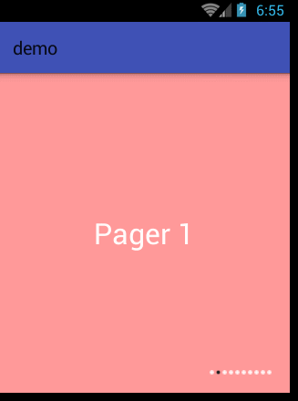

# 简介
---
本项目是一个简单的轮播图实现库，采用ViewPager+Handler实现，基本功能包括：
 1. 无限循环切换界面
 2. 自动无限循环切换

# 用法
---
1. 编译library库，然后将`library-release.aar`文件复制到lib文件夹，接着在模块的`build.gradle`下添加：

  ```
  compile(name: 'library-release', ext: 'aar')
  ```
  在项目的`build.gradle`下添加：
  ```
  allprojects {
      repositories {
          jcenter()
          flatDir {
              dirs 'libs'
          }
      }
  }
  ```
  
2. 新建一个`Activity`，在布局中添加`AutoViewPager`：
    ```xml
    <com.art.zok.autoview.AutoViewPager
        android:id="@+id/auto_view_pager"
        android:layout_width="match_parent"
        android:layout_height="match_parent"
        app:indicatorWidth="5dp"
        app:indicatorHeight="5dp"
        app:indicatorPadding="2dp"
        app:intervalTime="2000"
        app:selectedDrawable="@mipmap/indicator_normal"
        app:unselectedDrawable="@mipmap/indicator_selected"/>
    ```
    本库为用户提供六个自定义属性，分别是：
    * `indicatorWidth`：指示器宽度，默认为8dp。
    * `indicatorHeight`：指示器高度，默认为8dp。
    * `indicatorPadding`：指示器之间的间距，默认为指示器宽度的一半。
    * `intervalTime`：自动播放时，页面之间的间隔时间，默认为2000毫秒。
    * `selectedDrawable`：选中的指示器的Drawable，默认为白填充效果。
    * `unselectedDrawable`：未选中的指示器的Drawable，默认为灰色填充效果。
    * `showPageTitle`：是否显示标题，默认为显示，需要重载适配器的`getPageTitle`方法，并且不能返回null。
    * `pageTitleFontSize`：标题尺寸，默认为16sp。
    * `pageTitleFontColor`：标题颜色，默认为白色。
3. 在`Activity`设置适配器：
    ```java
      public class MainActivity extends AppCompatActivity {
          @Override
          protected void onCreate(Bundle savedInstanceState) {
              ...
              AutoViewPager autoViewPager = (AutoViewPager) findViewById(R.id.auto_view_pager);

              autoViewPager.setPagerAdapter(new PagerAdapter() {
                  @Override
                  public int getCount() {
                      return 10;
                  }

                  @Override
                  public boolean isViewFromObject(View view, Object object) {
                      return view == object;
                  }

                  @Override
                  public Object instantiateItem(ViewGroup container, int position) {
                      TextView view = (TextView) getLayoutInflater().inflate(R.layout.pager_item, container, false);
                      view.setText("Pager " + position);
                      container.addView(view);
                      return view;
                  }

                  @Override
                  public void destroyItem(ViewGroup container, int position, Object object) {
                      container.removeView((View) object);
                  }
              });
          }
      }
    ```
    可以看到和原始的`ViewPager`使用上没有任何区别。到现在就已经实现无限循环切换，如果希望启动自动轮播，可以随时调用下面方法开始：
    ```java
    autoViewPager.start();
    ```
    `autoViewPager`也可以像原始的`ViewPager`那样设置触摸事件监听和页面切换事件监听：
    ```java
     autoViewPager.setOnTouchListener(new View.OnTouchListener() {
            @Override
            public boolean onTouch(View v, MotionEvent event) {
               ...
                return false;
            }
        });

     autoViewPager.setOnPageChangeListener(new ViewPager.OnPageChangeListener() {
            @Override
            public void onPageScrolled(int position, float positionOffset, int positionOffsetPixels) {
                Log.d("tag", "onPageScrolled");
            }
            ...
        });
    ```
# 效果
----
1. 不开启自动轮播效果：

  

2. 开启自动轮播效果：

  

# FIX
---
1. 实现`notifyDataSetChanged`数据动态变换
2. 添加标题显示功能